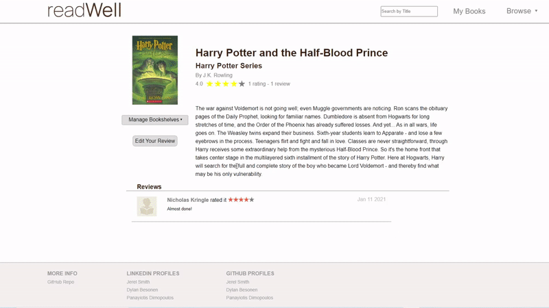
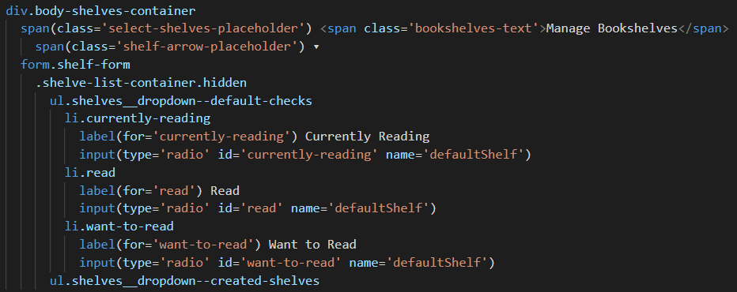
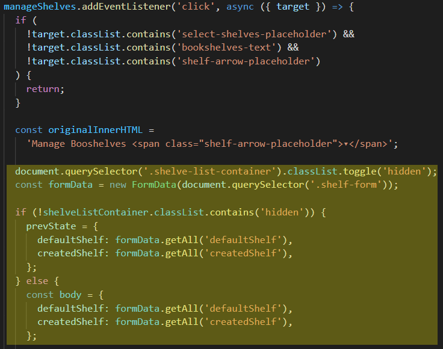
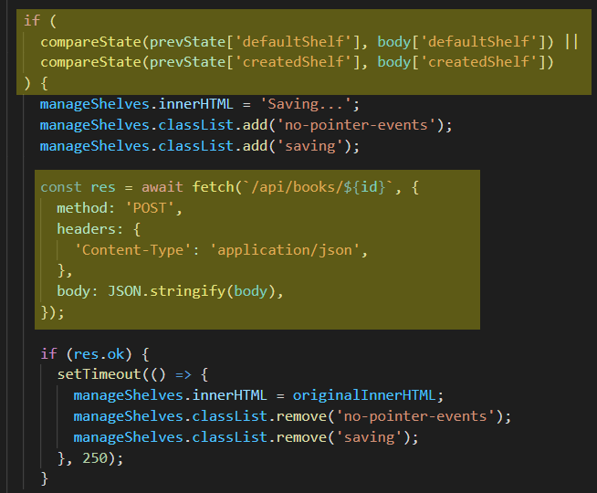
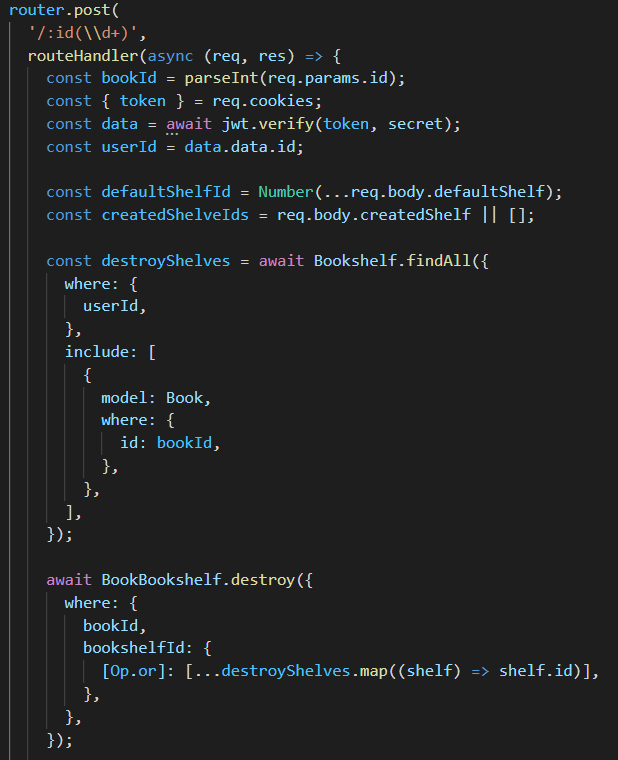
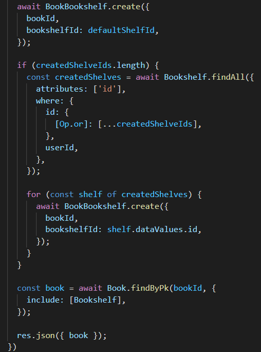

<h2 align="center">Book management on the web</h2>

## Table of Contents

- ### [About](#about)
- ### [Features & Demo](#featuresanddemo)
- ### [Code Snippets](#codesnippets)
- ### [Future Features](#futurefeatures)
- ### [Credits](#credits)

<h2 id="about">About</h2>

<a href="https://aagoodreads.herokuapp.com"><strong>readWell</strong></a> is a fullstack book management application built with <strong>Pug.js / CSS / JavaScript, Express, and PostgreSQL</strong> that aims to give book fans a platform to <em><strong>track books they have read</strong></em>, <em><strong>discover new books to read</strong></em>, and <em><strong>leave reviews on books they either love or hate</strong></em>. Its user experience is built with simplicity in mind to make it a usable website for people of all different walks of life.

<h2 id="featuresanddemo">Features</h2>

### Auth:

Users can...

- Sign in as a demo user if they don't have an account
- Create an account
- Sign into an existing account

### Books - (Search and Browse):

Users can...

- Browse books by Title
- Search books by Title
- View any individual book resource

### Bookshelves:

<li>Three default shelves are automatically created when a user signs up for readWell (Read, Currently Reading, Want to Read)</li>
 
Users can...
<ul>
<li>Create a bookshelf</li>
<li>Delete a bookshelf</li>
<li>Add a book to a <em><strong>single default shelf</strong></em> and as many created shelves as they would like</li>
<li>Remove a book from all bookshelves</li>
</ul>

### Reviews:

Users can...

- View reviews for a given book on its associated book page
- Leave a review on a book
- Edit a review they have already left on a book

<h2 id="codesnippets">Code Snippet(s)</h2>

**Adding / Moving Books to Various Bookshelves**

On <strong>readWell</strong>, users are able to manage what bookshelves they have a particular book in from various pages. Here's what it looks like on the browse page:

 

A div element containing all of the information pertaining to what shelves the book belongs to is positioned relatively. The form, which contains various radio buttons and checkboxes, is positioned absolutely and given a class which hides all of its content.

The click event handler toggles the hidden class when the outer div is clicked, if the dropdown is opening, the event handler stores the state of what bookshelves the user would like the specific book in inside of an object called prevState. After the user selects their desired bookshelves and clicks the outer div once again, the event handler checks if the current state of the form matches the state stored in prevState. If the two states do not match, an AJAX request is made to the server to alter which bookshelves the book is in for the user, otherwise the function returns early.

When the request hits the Express server, it first checks which default bookshelf the book is in, if the book is already in a default bookshelf it removes the book from that shelf. It then adds the book to the submitted default bookshelf and any created bookshelves the user selected. After that, the server finally sends a response with the updated book information.

 

<h2 id="credits">Credits</h2>

- All book cover images are pulled directly from [goodreads.com](https://goodreads.com)
